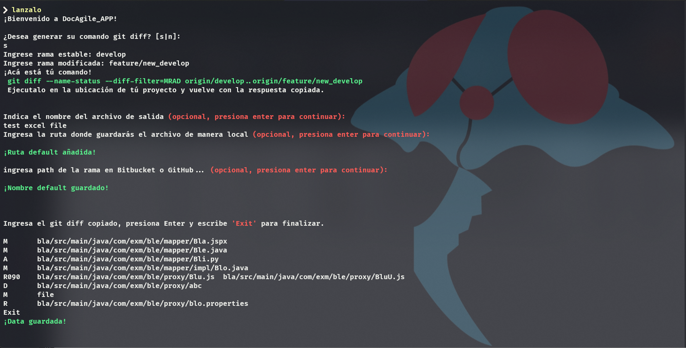
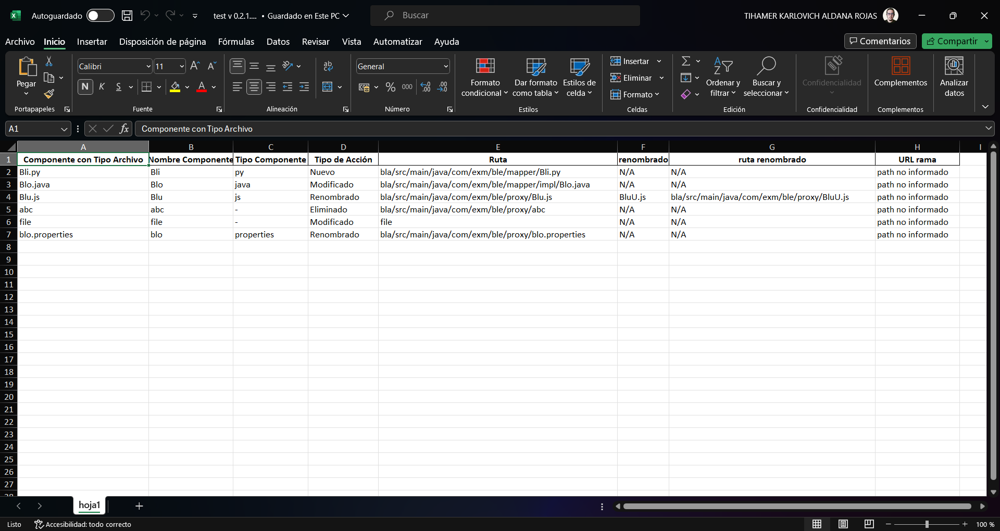

# DocAgile_App
<p>Proyecto pensado para facilitar la documentación de los componentes modificados con los datos obtenidos del comando:</p>

```bash
git diff --name-status --diff-filter=MRAD origin/"rama Estable"..origin/"rama modificada"
```
#### Resultado ejemplo de ejecución del comando anterior:

```text
M       bla/src/main/java/com/exm/ble/mapper/Bla.jspx
M       bla/src/main/java/com/exm/ble/mapper/Ble.java
A       bla/src/main/java/com/exm/ble/mapper/Bli.py
M       bla/src/main/java/com/exm/ble/mapper/impl/Blo.java
R090    bla/src/main/java/com/exm/ble/proxy/Blu.js  bla/src/main/java/com/exm/ble/proxy/BluU.js
D       bla/src/main/java/com/exm/ble/proxy/abc
M       file
R       bla/src/main/java/com/exm/ble/proxy/blo.properties
```
<p>El anterior es el texto que copiaremos y pegaremos en la consola cuando el programa lo solicite.</p>

### Diagramas
Para visualización de los diagramas empleados para este desarrollo de [clic acá.](resources/Diagrams.md)

<p>Requerido tener instalado y actualizado pip y pandas, para ello usaremos lo siguiente:</p>
 
### Para instalación y actualización de pip:

Te puedes apoyar [acá](https://phoenixnap.com/kb/install-pip-windows) con respecto a la instalación.

Para actualizar pip:
```bash
python.exe -m pip install --upgrade pip --user  
```
> Si es requerido validar que versión de python se está usando para asi mismo saber si iniciar con `py`,
> `python` o `python3`. En este caso se usó python 3.9

## Libs necesarias para usar este proyecto: 
Lo instalaremos todo en conjunto al instalar `setup.py`.

#### Instalación de la librería openpyxl (por si acaso):
<p>Para el correcto funcionamiento debemos instalar o actualizar esta librería:</p>

```bash
python -m pip install --upgrade openpyxl
```

## Para iniciar el proyecto en la terminal:

Primero hay que ubicarse en el proyecto en la terminal, luego de eso continua con los siguientes pasos:

#### Para poder ejecutar el setup.py:
```bash
pip install -U setuptools --user
```
- Luego de instalar el setuptools procedemos con lo siguiente

#### Instalar setup.py modo develop:
```bash
python setup.py develop --user
```
- Tras realizar lo anterior ya se puede iniciar el proyecto desde la terminal sin necesidad de ubicar la ruta de este, 
únicamente abrimos una nueva terminal y ejecutamos:

```bash
lanzalo
```

O también:
```bash
launch_it
```

## Ejemplo de uso

Ejecución programa:



Tras la ejecución, se abre el archivo Excel con la entrada formateada:


