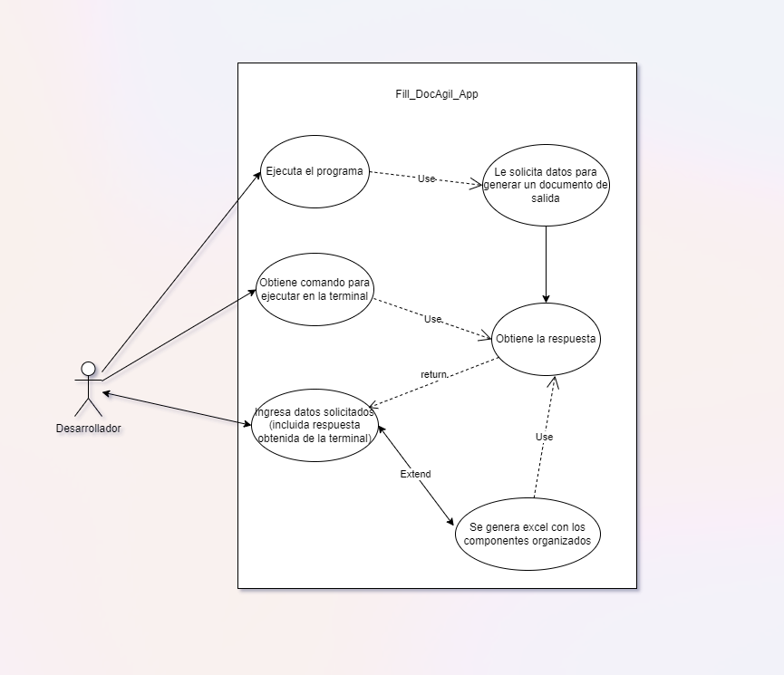
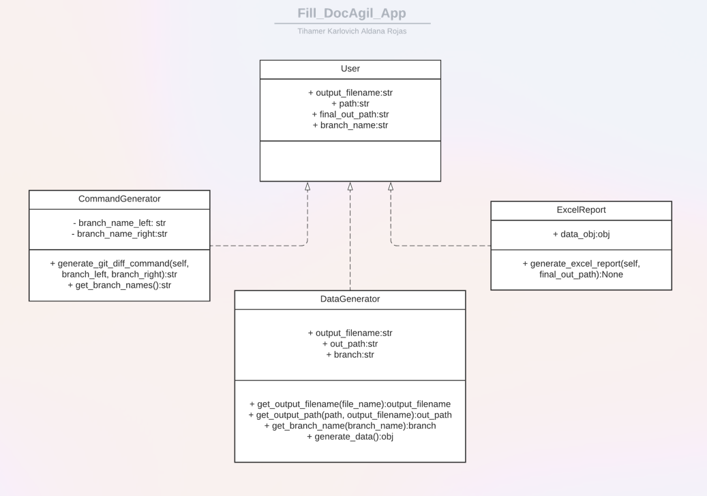
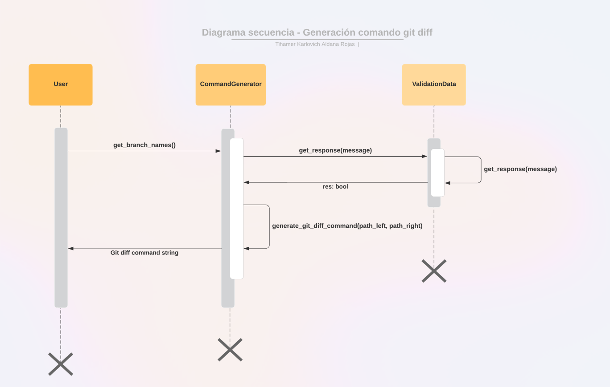

# Diagrams del proyecto

Para conocimiento de lo desarrollado se evidencian los siguientes diagramas:

### Diagrama casos de uso:
Acá evidenciamos como es de sencillo usar el programa para un usuario.

### Diagrama clases UML:
En este diagrama se muestran las 4 clases principales que intervienen en el proceso de ejecución del proyecto.

### Diagrama secuencia, ejemplo generación comando Git Diff:
Para dar evidencia de lo sencillo que es realizar uno de los procesos de la solución de Software propuesta, vamos a ver el proceso de creación del comando personalizado de Git, para el usuario. Este comando es el que se ejecuta en la ubicación del proyecto y luego el resultado sé copia y pega en el programa, cuando lo solicita. 

Para volver a la página principal de [clic acá.](../README.md)